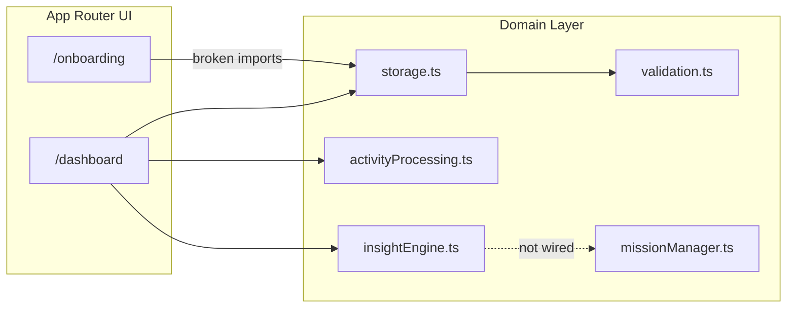
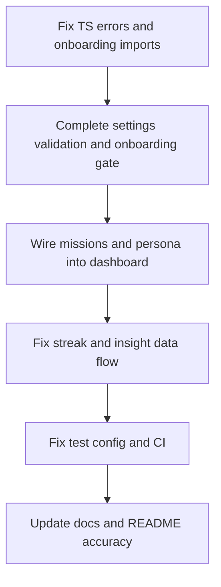

# CarbonPulse Project Audit

## What This Project Is

**CarbonPulse** ([README.md](README.md)) is a local-first personal carbon tracker built for PromptWars. Users log daily transport, diet, and home energy; a native TypeScript engine estimates CO₂e using DEFRA/EPA factors. Data lives in `localStorage` — no backend, auth, or external APIs.



**Stack:** Next.js 16, React 19, Tailwind 4, TypeScript (strict), Vitest, Playwright  
**Size:** ~41 source files — small, focused codebase  
**Competition context:** [plan.md](plan.md) notes rank **#22,291 / 31,538** and tracks a remediation roadmap

---

## Current Status Summary

| Area | Status | Score (approx.) |
|------|--------|-----------------|
| Core tracking + visualization | Working | 85% |
| Security hardening | Mostly done | 75% |
| Accessibility | Good foundation | 80% |
| Testing | Partial, misconfigured | 40% |
| Type safety / build health | **Broken** | 30% |
| Feature completeness (missions, persona, AI) | Partially built, not wired | 45% |
| DevOps / CI | Missing | 10% |

**Bottom line:** The project has moved significantly beyond its original low rank diagnosis (strict TS, middleware, validation, unit tests, a11y, export, goals). However, **recent feature additions (persona, missions, onboarding) were not fully integrated**, leaving **37 TypeScript errors**, a **broken onboarding page**, and **dead imports** on the dashboard. The app may run in dev mode with lenient behavior, but `npx tsc --noEmit` and likely `npm run build` fail today.

---

## What Works Well

### 1. Core product loop (MVP-complete)
- Activity logging via [components/ActivityForm.tsx](components/ActivityForm.tsx)
- Emission engine in [lib/activityProcessing.ts](lib/activityProcessing.ts) with DEFRA/EPA constants in [lib/constants.ts](lib/constants.ts)
- Dashboard with footprint ring, 7-day trend, history table, goals, benchmarks, CSV export — [app/dashboard/page.tsx](app/dashboard/page.tsx)
- Rule-based behavioral nudges (Fogg B=MAP) in [lib/insightEngine.ts](lib/insightEngine.ts)

### 2. Engineering quality signals already in place
- Modular `lib/` architecture: types, validation, storage, processing, insights, missions
- Runtime validation + clamping in [lib/validation.ts](lib/validation.ts)
- Safe localStorage reads with schema checks in [lib/storage.ts](lib/storage.ts)
- Security middleware (CSP, X-Frame-Options, nosniff, referrer/permissions policies) in [middleware.ts](middleware.ts)
- Accessibility: skip nav, focus trap dialog, ARIA live regions, reduced motion — [components/ConfirmDialog.tsx](components/ConfirmDialog.tsx), [components/SkipNav.tsx](components/SkipNav.tsx)
- Memoization patterns on dashboard and chart components

### 3. Tests exist (but need fixes)
- **19/20** unit tests pass across 3 files in [lib/__tests__/](lib/__tests__/)
- E2E spec exists at [e2e/dashboard.spec.ts](e2e/dashboard.spec.ts) (5 scenarios: load, submit, reset, keyboard, responsive)

### 4. Recent git activity shows momentum
Recent commits: mission system, onboarding, insight engine, modular refactor. Uncommitted: modified [AGENTS.md](AGENTS.md), untracked [plan.md](plan.md).

---

## Critical Issues (Fix First)

### 1. TypeScript does not compile — 37 errors
Running `npx tsc --noEmit` fails. Root causes:

**A. `UserSettings` type expanded but validation not updated**

```201:223:lib/validation.ts
export function validateStoredSettings(data: unknown): UserSettings {
  const defaults: UserSettings = {
    dailyTargetKg: DEFAULT_DAILY_BASELINE_KG,
    weeklyTargetKg: DEFAULT_WEEKLY_TARGET_KG,
  };
  // ... only returns dailyTargetKg + weeklyTargetKg
}
```

Missing: `persona`, `onboardingCompleted`, `missionState`, `unlockedBadges` — also breaks dashboard state init at [app/dashboard/page.tsx](app/dashboard/page.tsx) lines 38–41.

**B. `RecentLog` vs `ActivityLog` mismatch**
Dashboard passes `RecentLog[]` to `generateDailyNudge()` which expects `ActivityLog[]`. Engine reads `lastLog.carbonSavedKg` but `RecentLog` uses `totalCarbonSaved` — nudge equivalencies can be wrong at runtime.

**C. `PERSONA_FRAMES.message` typed as `string` but implemented as functions** — 12 errors in [lib/insightEngine.ts](lib/insightEngine.ts)

**D. Onboarding has broken import paths**
[app/onboarding/page.tsx](app/onboarding/page.tsx) imports `../lib/...` (resolves to nonexistent `app/lib/`). Should be `../../lib/...` like the dashboard.

### 2. Onboarding is unreachable
[app/page.tsx](app/page.tsx) always redirects `/` → `/dashboard`. Onboarding data (persona, mission state) is saved but stripped on reload by incomplete validation — personalization never persists.

### 3. Missions system built but not rendered
[app/dashboard/page.tsx](app/dashboard/page.tsx) imports `MissionProgress`, `updateMissionProgress`, `suggestNextMission` but never uses them. [components/MissionProgress.tsx](components/MissionProgress.tsx) and [lib/missionManager.ts](lib/missionManager.ts) are dead code from the UI perspective.

### 4. Test tooling misconfigured
- `npm run test` (Vitest) also picks up [e2e/dashboard.spec.ts](e2e/dashboard.spec.ts) — causes Playwright/Vitest conflict. Need `vitest.config.ts` to exclude `e2e/`.
- 1 failing unit test: NaN inputs produce negative points in [lib/__tests__/activityProcessing.test.ts](lib/__tests__/activityProcessing.test.ts)
- Playwright config has no `webServer` — E2E assumes dev server already running at `localhost:3000`
- ESLint config exists ([eslint.config.mjs](eslint.config.mjs)) but ESLint packages are **not** in [package.json](package.json) — `npm run lint` likely fails

### 5. Streak logic is incorrect
Dashboard uses `currentStreak: Math.min(logs.length, 30)` — counts total logs, not consecutive days. Gamification points/streaks are misleading.

---

## Feature Gaps vs README / Problem Statement

| Advertised Feature | Reality |
|-------------------|---------|
| AI-driven nudges | Rule-based only; [lib/aiCoach.ts](lib/aiCoach.ts) builds prompts but has no UI or API integration |
| Personalized insights | Persona collected in onboarding but never passed to `generateDailyNudge()` |
| Gamification (missions/badges) | Logic exists, UI not wired |
| Leaderboard | Rendered but **hardcoded mock data** in [components/Leaderboard.tsx](components/Leaderboard.tsx) |
| Onboarding | Page exists, broken imports, never gated |
| Long-term trend nudges | `analyzeCarbonTrends()` needs 14+ logs; dashboard only passes 3 recent entries |

---

## Documentation Drift

| Claim | Actual |
|-------|--------|
| README: Next.js 15 | package.json: Next **16.2.7** |
| README: HSTS header | [middleware.ts](middleware.ts) does not set `Strict-Transport-Security` |
| README: "AI-driven nudges" | Deterministic rules, not LLM |
| [plan.md](plan.md) diagnosis | Largely **outdated** — many items (strict TS, tests, CSP, a11y) are already implemented |

---

## Areas for Improvement (Prioritized)

### Priority 1 — Restore build health (highest impact for judges)
1. Fix onboarding import paths (`../../lib/...`)
2. Complete `validateStoredSettings()` to preserve all `UserSettings` fields with defaults
3. Align `generateDailyNudge()` signature with actual data — pass full `ActivityLog[]` or fix `RecentLog` usage; pass `settings.persona`
4. Fix `PERSONA_FRAMES` typing (message as function type, not string)
5. Fix dashboard `UserSettings` initialization and target-save handlers
6. Gate first visit: redirect to `/onboarding` when `onboardingCompleted === false`

### Priority 2 — Wire incomplete features
1. Render `MissionProgress` on dashboard; call `updateMissionProgress` on each log
2. Persist mission acceptance ("Commit to this action") into `missionState`
3. Fix streak calculation (consecutive calendar days)
4. Pass full log history (or last 14+) to insight engine for trend/leakage nudges

### Priority 3 — Testing and tooling
1. Add `vitest.config.ts` excluding `e2e/`
2. Fix failing NaN/negative input test (clamp points to >= 0)
3. Add Playwright `webServer: { command: 'npm run dev', url: '...' }`
4. Add ESLint deps to package.json or remove broken lint script
5. Expand tests: `storage.ts`, `validateStoredSettings`, `missionManager.ts`, onboarding flow
6. Add GitHub Actions CI: `tsc`, `vitest`, `playwright`, `build`

### Priority 4 — Honesty and polish
1. Update README (Next 16, rule-based nudges, remove HSTS claim or add header)
2. Either restyle mock leaderboard to match design system or label clearly as demo data
3. Decide on AI coach: integrate (needs API + env) or document as future work
4. Add `package.json` metadata (`name`, `version`, `private`)
5. Sync or archive stale [plan.md](plan.md)

### Priority 5 — Nice-to-have
- Storage version migration (mentioned in plan, not implemented)
- Error boundary for React
- User feedback on localStorage failures
- `React.lazy` for Leaderboard (bundle size optimization)
- Docker / deployment config if targeting production

---

## Suggested Implementation Order



**Estimated effort:** Priority 1–2 is ~1 focused session; full polish through Priority 5 is ~2–3 sessions.

---

## Verification Checklist (Current vs Target)

| Check | Current | Target |
|-------|---------|--------|
| `npx tsc --noEmit` | FAIL (37 errors) | PASS |
| `npm run test` | FAIL (Vitest picks up E2E + 1 unit failure) | PASS |
| `npm run test:e2e` | Unknown (needs running server) | PASS with webServer |
| `npm run build` | Likely FAIL | PASS |
| `npm run lint` | Likely FAIL (missing deps) | PASS |
| Onboarding flow | Broken | First-run works, persona persists |
| Missions UI | Not rendered | Visible and updates on log |

---

## Conclusion

CarbonPulse has a **solid foundation** — clean architecture, working core tracker, security middleware, accessibility work, and meaningful unit tests. The project looks like it underwent a **rapid feature sprint** (persona, missions, onboarding) that outpaced integration and type consistency.

**Current state:** Functional prototype for daily logging and visualization, but **not production-ready or competition-polished** due to compile failures, unwired features, and test/config gaps.

**Biggest wins available:** Fix TypeScript integration (1–2 hours), wire onboarding + missions + persona (2–3 hours), fix test tooling + CI (1 hour). These would move the project from "bottom third" toward a coherent, judge-friendly submission.
